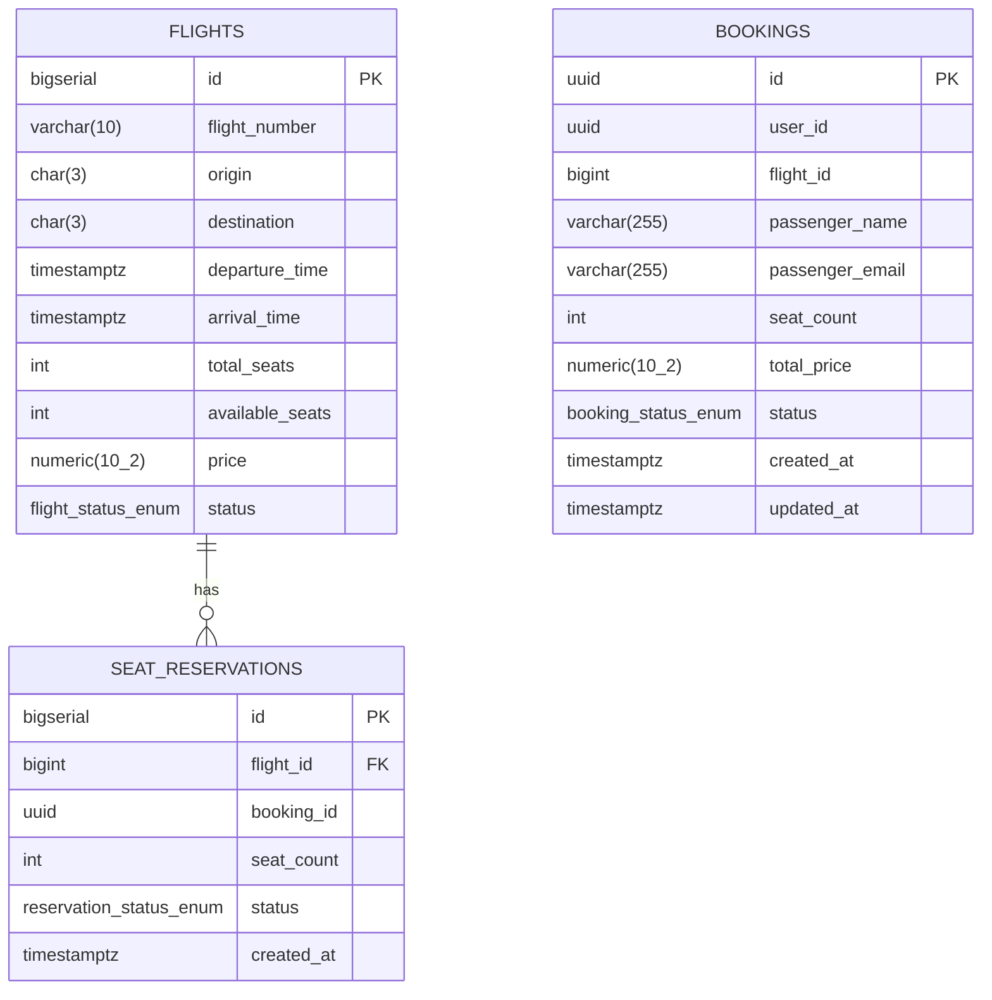

# Flight Booking System — gRPC + Redis


## ER-диаграмма



**flight_db** (Flight Service):
- `flights` — информация о рейсах (UNIQUE на flight_number + date)
- `seat_reservations` — резервации мест (UNIQUE на booking_id для идемпотентности)

**booking_db** (Booking Service):
- `bookings` — бронирования пассажиров (flight_id — логическая ссылка, не FK)

## Запуск

```bash
docker-compose up --build
```

swagger
```
http://localhost:8000/docs
```

## Компоненты

### gRPC контракт 
- Методы: SearchFlights, GetFlight, ReserveSeats, ReleaseReservation
- Используются Timestamp, enum для статусов
- Error codes: NOT_FOUND, RESOURCE_EXHAUSTED, UNAUTHENTICATED, ALREADY_EXISTS

### Транзакционная целостность 
- `ReserveSeats`: SELECT FOR UPDATE + атомарный декремент available_seats
- `ReleaseReservation`: атомарный возврат мест + RELEASED

### Аутентификация gRPC 
- API Key в gRPC metadata (`x-api-key`)
- Конфигурация через env `FLIGHT_SERVICE_API_KEY`

### Redis Cache-Aside 
- Ключи: `flight:{id}`, `search:{origin}:{destination}:{date}`
- TTL: 600 секунд
- Инвалидация после ReserveSeats/ReleaseReservation
- Логи cache hit/miss

### Retry
- Exponential backoff: 100ms, 200ms, 400ms
- Только для UNAVAILABLE, DEADLINE_EXCEEDED
- Идемпотентность ReserveSeats через уникальный booking_id

### Redis Sentinel
- master + replica + sentinel в docker-compose
- Клиент через `redis.sentinel.Sentinel`

### Circuit Breaker
- Состояния: CLOSED/OPEN/HALF_OPEN
- Параметры через env: CB_FAILURE_THRESHOLD, CB_TIMEOUT, CB_WINDOW
- В состоянии OPEN — 503 Service Unavailable
