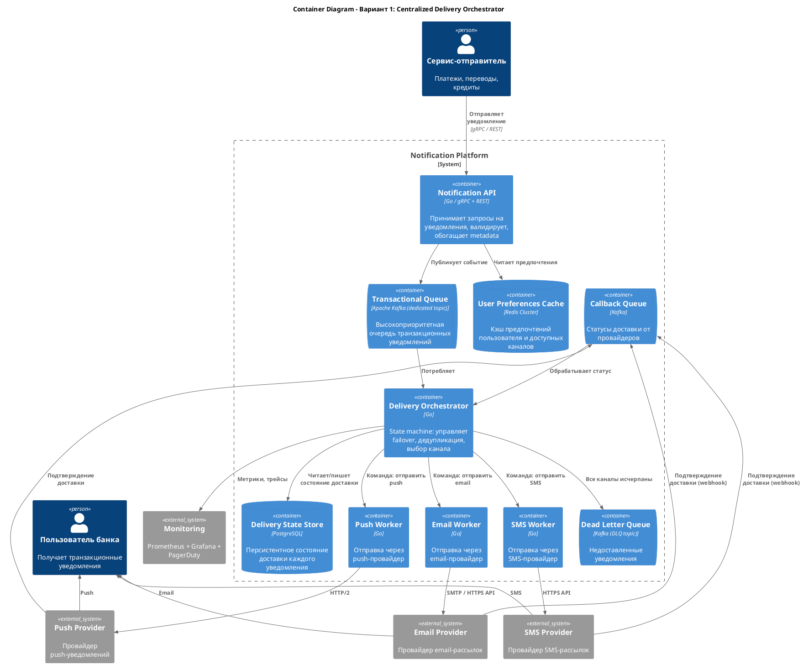
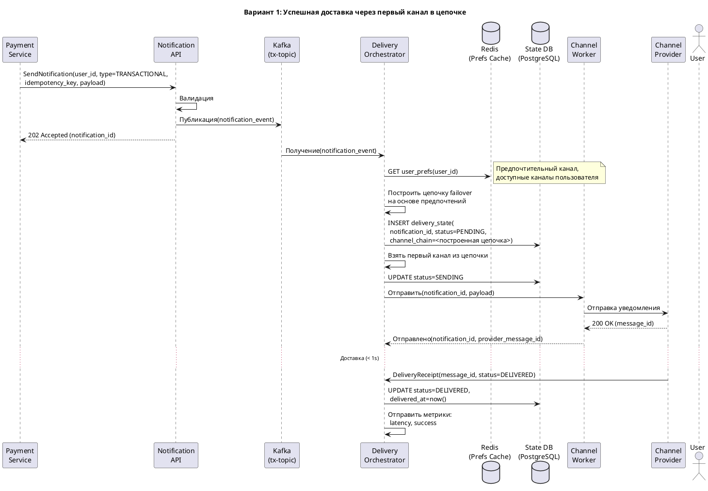
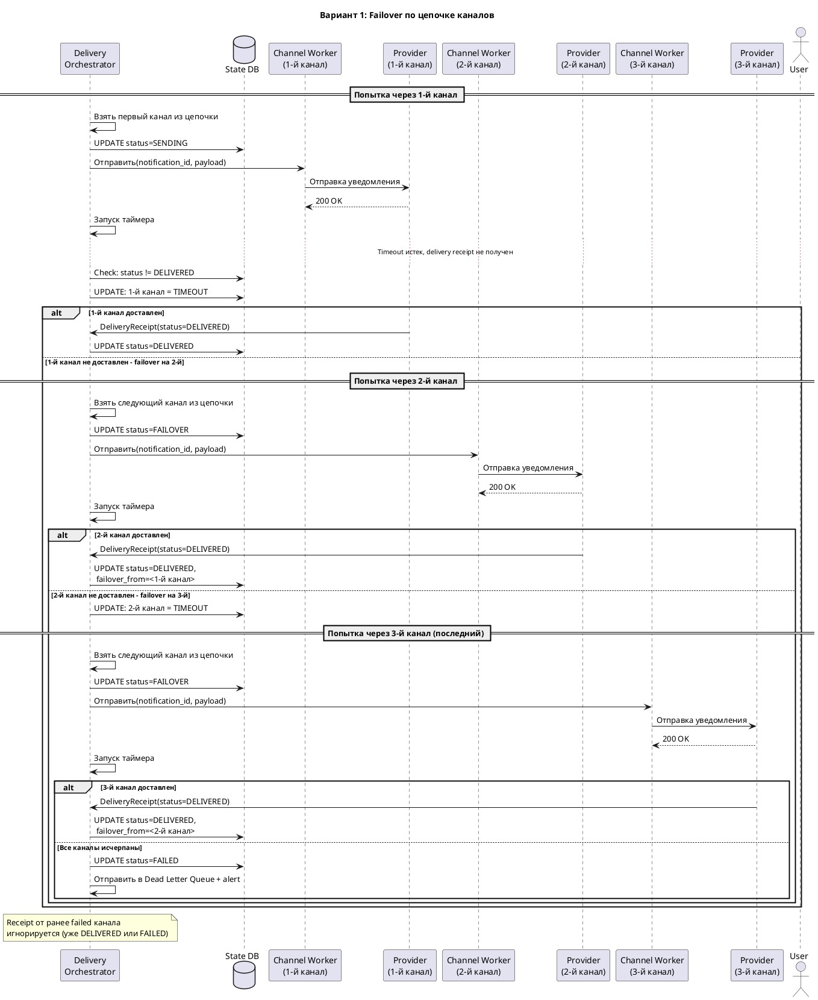
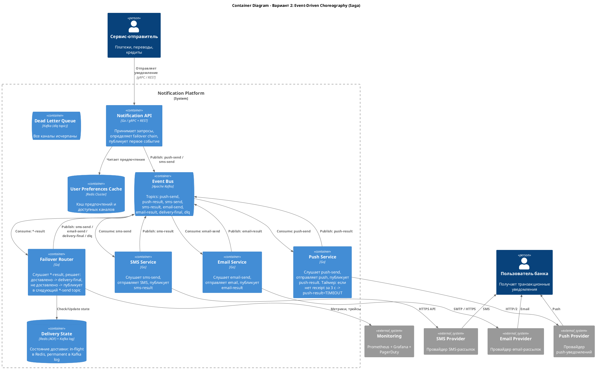
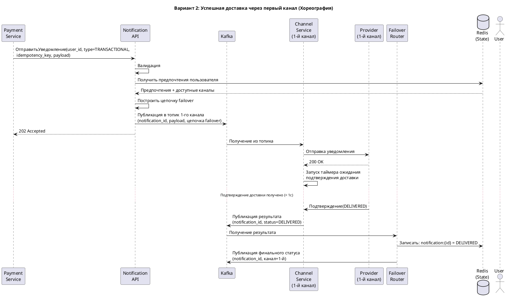
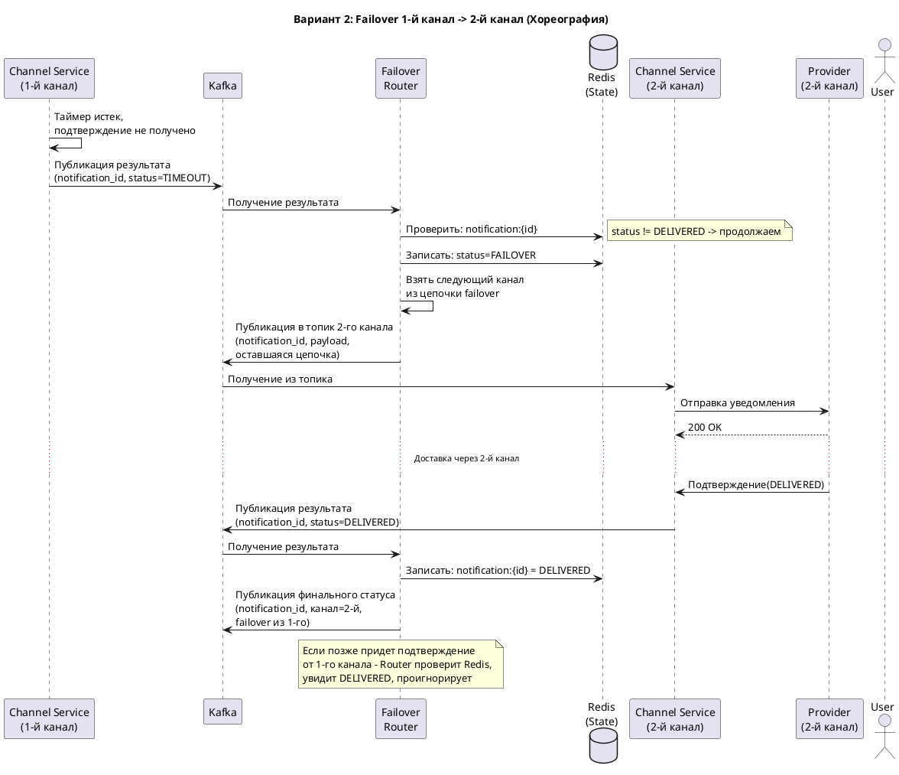

# RFC: Гарантированная доставка критичных уведомлений с кросс-канальным failover

| Метаданные      | Значение                                  |
|-----------------|-------------------------------------------|
| Статус          | DRAFT                                     |
| Автор(ы)        | Костин Д.И.                               |
| Ответственный   | Костин Д.И.                               |
| Бизнес-заказчик | Продуктовая команда Notification Platform |
| Ревьюеры        | -                                         |
| Дата создания   | 2026-04-07                                |
| Дата обновления | 2026-04-07                                |

---

## Оглавление

1. [Контекст](#контекст)
2. [Пользовательские сценарии](#пользовательские-сценарии)
3. [Требования](#требования)
4. [Статистика и расчет нагрузки](#статистика-и-расчет-нагрузки)
5. [Варианты решения](#варианты-решения)
6. [Сравнительный анализ](#сравнительный-анализ)
7. [Выводы](#выводы)
8. [Приложения](#приложения)

---

## Контекст

### Какую проблему мы решаем?

В текущей архитектуре онлайн-банка каждая команда самостоятельно отправляет уведомления пользователям. Это приводит к:
- Отсутствию гарантии доставки - если push не доставлен, то из-за отсутствия фолбэка на другой канал, повторной попытки отправки не происходит
- Дублированию уведомлений - при ретраях без идемпотентности и дедупликации пользователь получает одно и то же сообщение несколько раз
- Невозможности failover - при недоступности SMS-провайдера уведомление просто теряется
- Отсутствию централизованной наблюдаемости - невозможно понять было ли доставлено уведомление

### Почему это важно сейчас?

Транзакционные уведомления (подтверждение перевода, списание средств, OTP-коды) - критичны для безопасности и пользовательского опыта. Их недоставка:
- Снижает доверие пользователей к банку
- Создает риски безопасности (пользователь не узнает о несанкционированном списании)
- Генерирует нагрузку на call-центр
- Бизнес-цель: снизить жалобы на уведомления на 30% и обеспечить 100% доставку критичных уведомлений

### Кто затронут этим изменением?

- Пользователи банка - получают уведомления
- Команды-отправители (платежи, переводы, кредиты) - переходят на единый API
- Команда платформы уведомлений - разрабатывает и поддерживает подсистему
- Команды SRE - получают инструмент для диагностики доставки

### Ключевые вопросы
- Как гарантировать доставку минимум через один канал?
- Как автоматически переключаться между каналами без дублирования?
- Как минимизировать стоимость при сохранении гарантий?

---

## Пользовательские сценарии

| Приоритет   | Тип сценария   | Действующее лицо | Сценарий                                                                                                                                                                                                                                                    |
|-------------|----------------|------------------|-------------------------------------------------------------------------------------------------------------------------------------------------------------------------------------------------------------------------------------------------------------|
| MUST HAVE   | Доставка       | Пользователь     | При совершении перевода пользователь получает push-уведомление о списании в течение 1 секунды. Если push не доставлен за 3 с - автоматически отправляется SMS, если в течение 5 с от оператора получена ошибка об отправке SMS, то отправка письма на email |
| MUST HAVE   | Failover       | Система          | При недоступности push-провайдера система автоматически переключается на SMS, затем на email. Пользователь гарантированно получает уведомление хотя бы через один канал.                                                                                    |
| MUST HAVE   | Дедупликация   | Пользователь     | При failover с push на SMS пользователь не получает оба уведомления, если push все-таки был доставлен с задержкой (либо получает, но с пометкой).                                                                                                           |
| MUST HAVE   | Безопасность   | Пользователь     | Пользователь не может отключить транзакционные уведомления (списания, входы в аккаунт).                                                                                                                                                                     |
| SHOULD HAVE | Предпочтения   | Пользователь     | Пользователь может выбрать предпочтительный канал доставки (например, всегда SMS первым). Система учитывает это при построении цепочки failover.                                                                                                            |
| SHOULD HAVE | Мониторинг     | Оператор/SRE     | Оператор видит в реальном времени delivery rate по каналам, количество failover-ов и среднюю latency. При падении delivery rate ниже порога - срабатывает alert.                                                                                            |
| COULD HAVE  | Диагностика    | Поддержка        | Сотрудник поддержки может найти уведомление по ID пользователя и увидеть полную историю доставки: какой канал был выбран, были ли failover-ы, финальный статус.                                                                                             |

---

## Требования

### Функциональные требования

| № | Приоритет   | Обозначение | Требование                                                                                                                                                              |
|---|-------------|-------------|-------------------------------------------------------------------------------------------------------------------------------------------------------------------------|
| 1 | MUST HAVE   | FR1         | Система принимает запрос на отправку транзакционного уведомления и гарантирует его доставку хотя бы через один канал (push, SMS, email).                                |
| 2 | MUST HAVE   | FR2         | При неподтвержденной доставке через основной канал в течение настроенного timeout-а система автоматически инициирует отправку через следующий канал в цепочке failover. |
| 3 | MUST HAVE   | FR3         | Система предотвращает дублирование: если основной канал подтвердил доставку после инициации failover, повторная отправка отменяется (или помечается).                   |
| 4 | MUST HAVE   | FR4         | Цепочка failover учитывает пользовательские предпочтения (предпочтительный канал) и доступность каналов у пользователя (наличие email, телефона, разрешение push).      |
| 5 | MUST HAVE   | FR5         | Транзакционные уведомления не могут быть отключены пользователем.                                                                                                       |
| 6 | SHOULD HAVE | FR6         | Для каждого уведомления доступна полная история доставки: выбранный канал, попытки, failover, финальный статус, timestamp каждого этапа.                                |
| 7 | SHOULD HAVE | FR7         | При исчерпании всех каналов (все попытки неуспешны) уведомление попадает в Dead Letter Queue с alert-ом для команды мониторинга.                                        |

### Нефункциональные требования

| № | Приоритет   | Обозначение | Требование                                                                                  |
|---|-------------|-------------|---------------------------------------------------------------------------------------------|
| 1 | MUST HAVE   | NFR1        | Latency p99 от приема уведомления до передачи первому провайдеру <= 1 с                     |
| 2 | MUST HAVE   | NFR2        | SLA подсистемы не ниже 99.95%                                                               |
| 3 | MUST HAVE   | NFR3        | Потеря транзакционных уведомлений = 0 (at-least-once delivery)                              |
| 4 | MUST HAVE   | NFR4        | Пиковая пропускная способность >= 1000 RPS к провайдерам (с учетом failover)                |
| 5 | SHOULD HAVE | NFR5        | 100% уведомлений имеют трейсы от приема до финального статуса                               |
| 6 | SHOULD HAVE | NFR6        | Failover timeout: push - 3 с, SMS - 30 с, email - 60 с (настраиваемые)                      |
| 7 | SHOULD HAVE | NFR7        | Стоимость: push - предпочтительный канал (бесплатно), SMS используется только при failover  |

### Архитектурно значимые требования (ASR)

#### ASR-1: Низкая задержка доставки транзакционных уведомлений (p99 <= 1 с до провайдера)

Связанные требования: FR1, NFR1, NFR4

Почему влияет на архитектуру:
Требование p99 <= 1 с диктует выделение отдельной высокоприоритетной очереди (fast-path) для транзакционных уведомлений 
с минимальным количеством hop-ов. Исключает batch-обработку для данного типа - нужна event-driven push-модель. Требует
in-memory кэш пользовательских предпочтений (Redis), чтобы не ходить в БД на hot path. Влияет на выбор брокера, модель 
обработки и топологию сервисов.

#### ASR-2: Гарантированная доставка с автоматическим кросс-канальным failover и дедупликацией

Связанные требования: FR2, FR3, NFR3

Почему влияет на архитектуру:
Необходимость гарантировать доставку хотя бы через один канал требует реализации машины состояний для каждого уведомления, 
персистентного хранения состояния доставки, таймеров для определения таймаута канала и механизма идемпотентности для 
предотвращения дублирования при failover. Это определяет наличие отдельного компонента-оркестратора (или роутера) и 
выбор между хореографией и оркестрацией как ключевое архитектурное решение.

#### ASR-3: Изоляция транзакционных уведомлений от остального трафика платформы

Связанные требования: NFR1, NFR4

Почему влияет на архитектуру:
Без физической изоляции массовая маркетинговая рассылка на 1 млн пользователей вызовет head-of-line blocking и 
деградацию latency транзакционных уведомлений. Это требует раздельных очередей, раздельных  консюмер-групп 
и потенциально раздельных инстансов воркеров для транзакционного и остального трафика. Определяет 
partitioning-стратегию и архитектуру очередей.

#### ASR-4: Наблюдаемость: сквозной трейсинг и аудит каждого уведомления

Связанные требования: FR6, NFR5

Почему влияет на архитектуру:
Требование сквозного трейсинга от приема до финального статуса влияет на формат сообщений (обязательный trace ID 
в каждом сообщении), выбор инструментов, необходимость event log/audit trail и архитектуру хранения статусов 
(event sourcing/state-based). Каждый компонент должен пробрасывать trace context.
---

## Статистика и расчет нагрузки

### Масштаб системы и ожидаемая нагрузка

| Параметр                                          | Значение   |
|---------------------------------------------------|------------|
| MAU                                               | 10 000 000 |
| DAU                                               | 3 000 000  |
| Peak Concurrent Users                             | 300 000    |
| Транзакционных уведомлений на пользователя в день | 2          |
| Сервисных уведомлений на пользователь в день      | 3          |
| Маркетинговых уведомлений на пользователь в день  | 5          |

### Расчет нагрузки на подсистему критичных уведомлений

**Транзакционных уведомлений в день:**

$$DAU \times 2 = 3\,000\,000 \times 2 = 6\,000\,000 \text{ уведомлений/день}$$

**Средний RPS (транзакционные):**

$$\frac{6\,000\,000}{86\,400} \approx 70 \text{ RPS}$$

**Пиковый RPS (транзакционные):**

Пиковый час (например, 13:00–14:00 - обеденные покупки, переводы): ~20% дневного трафика приходится на 1 пиковый час.

$$\frac{6\,000\,000 \times 0.2}{3\,600} \approx 333 \text{ RPS}$$

**С учетом failover** (каждое уведомление может породить до 3 попыток):

$$333 \times 3 \approx 1\,000 \text{ RPS }$$

**Общая нагрузка на платформу (все типы):**

$$DAU \times 10 = 30\,000\,000 \text{ уведомлений/день}$$

- Средний RPS: $\frac{30\,000\,000}{86\,400} \approx 347$
- Пиковый RPS (20% трафика за пиковый час): $\frac{30\,000\,000 \times 0.2}{3\,600} \approx 1\,667$
- С массовой рассылкой (1 млн за 1 час): $\frac{1\,000\,000}{3\,600} \approx +278$ RPS, суммарный пик $\approx 2000$ RPS

### Требования к хранению

**Запись о состоянии доставки:** ~500 байт (JSON с metadata)

Оценка размера одной записи:
```json
{
  "notification_id": "550e8400-e29b-41d4-a716-446655440000",   // 36 байт
  "user_id": "123456789",                                      // 10 байт
  "idempotency_key": "pay-txn-550e8400",                       // 20 байт
  "type": "TRANSACTIONAL",                                     // 15 байт
  "payload": "Списание 1 500 руб. Карта *1234",                // ~80 байт
  "channel_chain": ["push", "sms", "email"],                   // 30 байт
  "current_channel": "sms",                                    // 5 байт
  "status": "DELIVERED",                                       // 10 байт
  "failover_from": "push",                                     // 5 байт
  "attempts": [
    {"channel": "push", "status": "TIMEOUT", "at": "..."},     // ~60 байт
    {"channel": "sms", "status": "DELIVERED", "at": "..."}     // ~60 байт
  ],
  "created_at": "2026-04-07T13:00:00.000Z",                    // 25 байт
  "delivered_at": "2026-04-07T13:00:03.200Z",                  // 25 байт
  "trace_id": "abc123def456",                                  // 15 байт
  "provider_msg_id": "SM1234567890"                            // 15 байт
}
// Итого: ~410 байт + служебные символы JSON ≈ 500 байт
```

$$6\,000\,000 \times 90 \text{ дней} \times 500\text{B} \approx 270 \text{ GB}$$

С индексами и overhead: ~400 GB

**Кэш предпочтений пользователей (Redis):**

Одна запись предпочтений: ~200 байт
```json
{
  "user_id": "123456789",                   // 10 байт
  "preferred_channel": "push",              // 5 байт
  "available_channels": ["push", "sms", "email"], // 25 байт
  "phone": "+7...",                         // 15 байт
  "email": "u@mail.ru",                    // 20 байт
  "marketing_enabled": false,               // 5 байт
  "service_enabled": true                   // 5 байт
}
// ~85 байт данных + ключи и служебные символы ≈ 200 байт
```

Кэшируем всех MAU (активные за месяц):

$$10\,000\,000 \times 200\text{B} \approx 2 \text{ GB}$$

С overhead Redis (~2x): ~4 GB - помещается в один инстанс Redis.

**Audit log (все типы, 90 дней):**

$$30\,000\,000 \times 90 \times 300\text{B} \approx 810 \text{ GB} \to \sim 1 \text{ TB}$$

---

## Варианты решения

### Вариант 1: Orchestration - централизованный Delivery Orchestrator

> Описание: Выделенный stateful-сервис (Delivery Orchestrator) управляет жизненным циклом каждого транзакционного уведомления, реализуя state machine failover-а. Брокер сообщений используется для приема и буферизации, а оркестратор принимает все решения о маршрутизации и failover.

#### Архитектура

C4 Container Diagram:



Sequence Diagram - основной сценарий:



Sequence Diagram - сценарий failover с тремя каналами:



#### Технологический стек

| Компонент              | Технология                                              | Обоснование                                                     |
|------------------------|---------------------------------------------------------|-----------------------------------------------------------------|
| Notification API       | Go + gRPC (внутренний) + REST (внешний)                 | Низкий latency, высокая производительность                      |
| Брокер сообщений       | Apache Kafka                                            | Стандарт индустрии, надежная, реплицируемая, высокий throughput |
| Delivery Orchestrator  | Go                                                      | Горутины для параллельной обработки, низкий memory footprint    |
| State Store            | PostgreSQL 16                                           | ACID для состояния доставки, надежность                         |
| User Preferences Cache | Redis Cluster                                           | Стандарт кэшей, быстрое чтение                                  |
| Мониторинг             | Prometheus + Grafana + Jaeger + PagerDuty               | Метрики, трейсинг, алертинг                                     |

#### Как решение выполняет каждый ASR

| ASR                                         | Как выполняется                                                                                                                                                                                                                   |
|---------------------------------------------|-----------------------------------------------------------------------------------------------------------------------------------------------------------------------------------------------------------------------------------|
| ASR-1 (Latency p99 ≤ 1 с)                   | Выделеленный Kafka топик для транзакционных -> Orchestrator читает с min latency. User prefs - из Redis cache. Прямой вызов worker-а. Общий path: API -> Kafka -> Orchestrator -> Worker -> Provider = 3 async hop-а, каждый < 100 мс. |
| ASR-2 (Гарантированная доставка + failover) | Машина состояний в Orchestrator с персистентным состоянием в PostgreSQL. Таймеры failover. Проверка перед каждой отправкой. DLQ после исчерпания каналов.                                                                         |
| ASR-3 (Изоляция транзакционных)             | Отдельный Kafka топик + отдельная консюмер группа + отдельные инстансы Orchestrator для транзакционных. Маркетинговые уведомления физически не конкурируют за ресурсы.                                                            |
| ASR-4 (Наблюдаемость)                       | trace_id пробрасывается через все компоненты. Каждый переход машины состояний логируется и отправляется в Jaeger. Prometheus метрики по каналу и типу.                                                                            |

#### Преимущества
- Простая и понятная модель: один сервис контролирует весь жизненный цикл
- Легко реализовать сложную логику failover (таймеры, приоритеты каналов, дедупликацию)
- Единое место для отладки и мониторинга доставки
- Полный audit trail в одной БД

#### Недостатки
- Orchestrator - потенциальный bottleneck и может стать единой точкой отказа (требует высокой доступности: несколько реплик + leader election)
- PostgreSQL на hot path (запись состояния при каждой отправке) добавляет latency (~5-10 мс)
- Вертикальное усложнение Orchestrator при добавлении новых каналов и правил

---

### Вариант 2: Choreography - событийная архитектура с Saga

> Описание: Нет централизованного оркестратора. Каждый channel worker - самостоятельный сервис, который реагирует на события и публикует результаты. Failover реализуется как цепочка событий (saga pattern): при неуспехе одного канала публикуется событие, которое триггерит следующий канал.

#### Архитектура

C4 Container Diagram:



Sequence Diagram - основной сценарий:



Sequence Diagram - сценарий failover:



#### Технологический стек

| Компонент                           | Технология                                | Обоснование                                                                              |
|-------------------------------------|-------------------------------------------|------------------------------------------------------------------------------------------|
| Notification API                    | Go + gRPC / REST                          | Аналогично варианту 1                                                                    |
| Event Bus                           | Apache Kafka                              | Durability, ordering, replay. Отдельные topics для каждого канала обеспечивают изоляцию. |
| Channel Services (Push, SMS, Email) | Go                                        | Независимые stateless сервисы                                                            |
| Failover Router                     | Go                                        | Stateless (состояние в Redis), горизонтально масштабируемый                              |
| In-flight State                     | Redis Cluster (AOF persistence)           | Sub-ms чтение/запись для hot path. AOF для durability.                                   |
| Permanent Audit Log                 | Kafka log (compacted topics)              | Event sourcing: полная история из Kafka topics                                           |
| Мониторинг                          | Prometheus + Grafana + Jaeger + PagerDuty | Аналогично варианту 1                                                                    |

#### Как решение выполняет каждый ASR

| ASR                                         | Как выполняется                                                                                                                                                                                                              |
|---------------------------------------------|------------------------------------------------------------------------------------------------------------------------------------------------------------------------------------------------------------------------------|
| ASR-1 (Latency p99 ≤ 1 с)                   | API -> Kafka (push-send) -> Push Service -> Provider. Redis вместо PostgreSQL на hot path (чтение/запись state < 1 мс). Каждый hop асинхронный, суммарно < 500 мс.                                                              |
| ASR-2 (Гарантированная доставка + failover) | Failover chain передается в сообщении. Router проверяет state в Redis при каждом result-событии и маршрутизирует на следующий канал. Kafka гарантирует at-least-once delivery между компонентами. Idempotency check в Redis. |
| ASR-3 (Изоляция транзакционных)             | Отдельные Kafka topics по каналам. Транзакционные и маркетинговые - разные consumer groups и инстансы channel services.                                                                                                      |
| ASR-4 (Наблюдаемость)                       | trace_id в каждом Kafka message header. Router пишет метрики при каждом переходе. Kafka log = audit trail (replay).                                                                                                          |

#### Преимущества
- Высокая масштабируемость: каждый компонент масштабируется независимо
- Нет единой точки отказа (Router - stateless, масштабируется горизонтально)
- Redis на hot path - минимальная latency для записи состояния
- Event sourcing: Kafka log - полный audit trail бесплатно
- Добавление нового канала = новый сервис + topic, без изменения существующих

#### Недостатки
- Сложнее отладка: путь уведомления распределен по нескольким topics и сервисам
- Больше Kafka topics и consumer groups - выше операционная сложность
- Redis AOF: при crash-е возможна потеря последних ~1 с данных (настраивается, но trade-off latency vs durability)
- Сложнее реализовать сложную логику (например, «подождать 30 с, если за это время пришел receipt от первого канала - отменить failover»)

---

## Сравнительный анализ

### Ресурсные требования

| Критерий                | Вариант 1 (Orchestrator)                                                                   | Вариант 2 (Choreography)                                                                    |
|-------------------------|--------------------------------------------------------------------------------------------|---------------------------------------------------------------------------------------------|
| Время реализации        | 8–10 недель                                                                                | 10–12 недель                                                                                |
| Команда                 | 3–4 backend-инженера, 1 SRE                                                                | 4–5 backend-инженеров, 1–2 SRE                                                              |
| Инфраструктура          | Kafka (3 брокера), PostgreSQL (primary + replica), Redis (cache), 3+ инстанса Orchestrator | Kafka (3–5 брокеров, больше topics), Redis Cluster (6 нод, AOF), нет PostgreSQL на hot path |
| Операционная сложность  | Средняя. Один ключевой сервис, но нужен HA (leader election)                               | Высокая. Много сервисов и topics, но каждый сервис прост                                    |

### Соответствие требованиям

| Требование                             | Вариант 1 (Orchestrator)                   | Вариант 2 (Choreography)                           |
|----------------------------------------|--------------------------------------------|----------------------------------------------------|
| FR1 (Гарантия доставки)                | ✅ Полный контроль в одном месте            | ✅ Kafka at-least-once + Redis state                |
| FR2 (Автоматический failover)          | ✅ State machine в Orchestrator             | ✅ Failover Router + event chain                    |
| FR3 (Дедупликация)                     | ✅ Idempotency check в PostgreSQL           | ✅ Idempotency check в Redis                        |
| FR4 (Пользовательские предпочтения)    | ✅ Orchestrator учитывает при выборе chain  | ✅ API формирует chain, Router следует              |
| FR5 (Запрет отключения транзакционных) | ✅ Проверка в API                           | ✅ Проверка в API                                   |
| FR6 (История доставки)                 | ✅ PostgreSQL - полная история              | ✅ Kafka log replay + Redis snapshot                |
| FR7 (DLQ)                              | ✅                                          | ✅                                                  |
| NFR1 (Latency p99 ≤ 1 с)               | ⚠️ PostgreSQL write на hot path (+5-10 мс) | ✅ Redis write < 1 мс                               |
| NFR2 (SLA 99.95%)                      | ⚠️ Orchestrator HA сложнее                 | ✅ Stateless Router, нет SPOF                       |
| NFR3 (Потери = 0)                      | ✅ ACID в PostgreSQL                        | ⚠️ Redis AOF: теоретический риск потери при отказе |
| NFR4 (Throughput 1000 RPS)             | ✅ Kafka + пул воркеров                     | ✅ Kafka + независимые сервисы                      |
| NFR5 (Distributed trace)               | ✅ Один сервис - проще                      | ⚠️ Распределенный - сложнее                        |

### Ключевые компромиссы

| Аспект                                  | Вариант 1                                                            | Вариант 2                                                        |
|-----------------------------------------|----------------------------------------------------------------------|------------------------------------------------------------------|
| Простота vs масштабируемость            | Проще в разработке и отладке, но сложнее масштабировать Orchestrator | Сложнее в разработке, но каждый компонент масштабируется линейно |
| Latency vs durability                   | PostgreSQL дает ACID, но +5-10 мс                                    | Redis дает мс, но менее надежен                                  |
| Операционная vs архитектурная сложность | Меньше сервисов, но Orchestrator - сложный                           | Много простых сервисов, но операционный overhead                 |
| Гибкость добавления каналов             | Изменение Orchestrator                                               | Добавление нового сервиса (Open/Closed Principle)                |

---

## Выводы

> Выбор: Вариант 2 - Event-Driven Choreography (Saga)

### Обоснование выбора

1. **Простота разработки и поддержки.** Вместо одного сложного stateful Orchestrator с state machine - набор маленьких stateless-сервисов, каждый из которых делает одну вещь: Channel Service отправляет уведомление и ждет подтверждение, Failover Router маршрутизирует по результату. Каждый сервис проще написать, протестировать и отладить по отдельности.

2. **Независимость команд и развертывания.** Каждый Channel Service разрабатывается и деплоится независимо. Добавление нового канала доставки = новый сервис + новый Kafka topic, без изменения существующего кода (Open/Closed Principle). В Orchestrator любое изменение логики - это правка единого сложного сервиса.

3. **Нет единой точки отказа.** Failover Router - stateless, масштабируется горизонтально без координации. Orchestrator же требует HA с leader election, partition-aware routing, что добавляет операционную сложность.

4. **Лучшая масштабируемость.** Каждый компонент масштабируется независимо по своей нагрузке. При пиковых 333 RPS это не критично, но архитектура готова к росту без переделки. Orchestrator при росте упрется в PostgreSQL (> 5 000 write TPS потребует шардирования).

5. **Меньшая latency на hot path.** Redis (< 1 мс на запись) вместо PostgreSQL (+5-10 мс). При текущих SLA (p99 ≤ 1 с) оба варианта укладываются, но у хореографии больший запас.

### Ограничения выбранного решения

- **Redis AOF - риск потери данных при crash.** В режиме `appendfsync everysec` возможна потеря последней ~1 с записей. Решение: Kafka log как источник истины - при рестарте Redis состояние восстанавливается из Kafka.
- **Сложнее сквозная отладка.** Путь уведомления проходит через несколько topics и сервисов. Решение: обязательный trace_id в каждом сообщении + distributed tracing (Jaeger) для восстановления полного пути.
- **Больше операционной сложности.** Больше сервисов, Kafka topics, consumer groups. Решение: стандартизированный шаблон Channel Service, единая конфигурация мониторинга.
- **Сложная логика отмены failover.** Если после переключения на 2-й канал пришло подтверждение от 1-го - нужна проверка в Redis на каждом шаге - требует аккуратности.

---

## Приложения

### Глоссарий

| Термин                       | Определение                                                                                                                      |
|------------------------------|----------------------------------------------------------------------------------------------------------------------------------|
| Транзакционное уведомление   | Уведомление, связанное с финансовой операцией (списание, перевод, OTP). Критичное, не может быть отключено пользователем.        |
| Failover                     | Автоматическое переключение на резервный канал доставки при неуспехе основного.                                                  |
| Failover chain               | Упорядоченная последовательность каналов для доставки (например, push - SMS -> email).                                           |
| Idempotency key              | Уникальный ключ уведомления, предотвращающий повторную отправку при retry/failover.                                              |
| DLQ (Dead Letter Queue)      | Очередь для уведомлений, доставка которых не удалась ни через один канал.                                                        |
| State machine                | Конечный автомат, описывающий жизненный цикл доставки уведомления (PENDING -> SENDING -> DELIVERED / FAILED -> FAILOVER -> ...). |
| Hot path                     | Критический путь обработки с минимальной допустимой задержкой.                                                                   |
| At-least-once delivery       | Гарантия, что сообщение будет обработано минимум один раз (допускается дублирование, но не потеря).                              |
| Backpressure                 | Механизм обратного давления: при перегрузке потребителя замедляется отправитель.                                                 |
